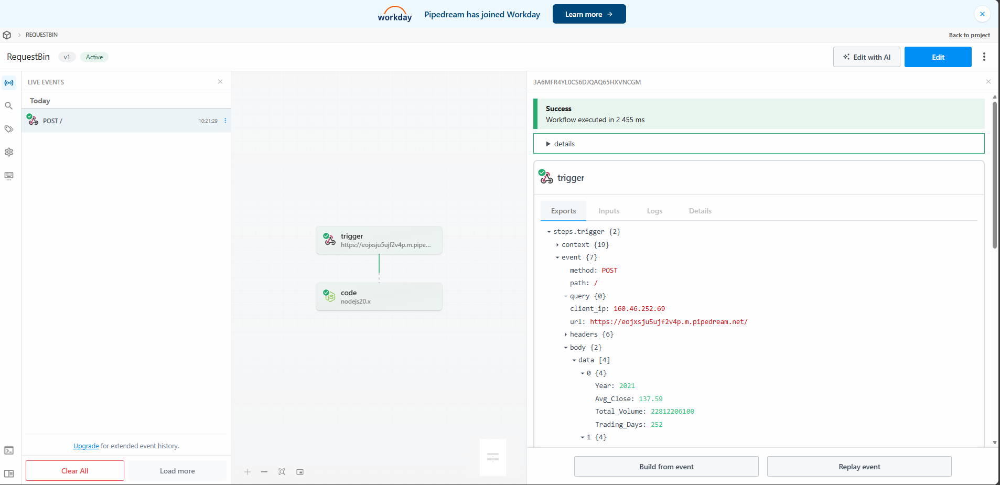

# Yahoo Finance ETL Pipeline

A production-ready Python ETL (Extract, Transform, Load) pipeline for processing historical stock data from Yahoo Finance. This project demonstrates modular design, data processing best practices, and professional Python development standards.

## 📋 Project Overview

This ETL pipeline:
- **Extracts** historical stock price data from Yahoo Finance (CSV format)
- **Transforms** the data by calculating yearly average closing prices and filtering by trading volume
- **Loads** the processed data to a webhook endpoint via HTTP POST

## 🎯 Features

- ✅ Modular architecture with separate Extract, Transform, and Load components
- ✅ Robust error handling and comprehensive logging
- ✅ Missing value handling with forward-fill strategy
- ✅ Volume-based filtering using list comprehension
- ✅ Yearly aggregation of stock metrics
- ✅ Configuration management via YAML
- ✅ Command-line interface with arguments
- ✅ Unit tests with pytest
- ✅ Professional project structure

## 🏗️ Project Structure

```
yahoo-etl-python/
├── src/
│   ├── __init__.py          # Package initialization
│   ├── extractor.py         # Yahoo Finance data extraction
│   ├── transformer.py       # Data transformation and processing
│   ├── loader.py            # HTTP POST data loading
│   └── main.py              # ETL pipeline orchestrator
├── config/
│   └── config.yaml          # Configuration file
├── data/
│   ├── raw/                 # Downloaded CSV files
│   └── processed/           # Transformed data
├── tests/
│   ├── __init__.py
│   └── test_etl.py          # Unit tests
├── logs/                    # Application logs
├── requirements.txt         # Python dependencies
├── .gitignore              # Git ignore patterns
└── README.md               # This file
```

## 🚀 Installation

### Prerequisites
- Python 3.8 or higher
- pip package manager
- Internet connection for Yahoo Finance API access

### Setup Steps

1. **Clone the repository**
   ```powershell
   git clone https://github.com/cecil-41/yahoo-etl-python.git
   cd yahoo-etl-python
   ```

2. **Create a virtual environment** (recommended)
   ```powershell
   python -m venv .venv
   .\.venv\Scripts\Activate.ps1
   ```

3. **Install dependencies**
   ```powershell
   pip install -r requirements.txt
   ```

4. **Configure webhook URL** (Optional)
   
   Get a test webhook URL from one of these services:
   - [Pipedream](https://pipedream.com/) (Recommended for corporate networks)
   - [RequestBin](https://requestbin.com/)
   - [Webhook.site](https://webhook.site/)
   
   Update `config/config.yaml` with your webhook URL:
   ```yaml
   webhook_url: "https://your-webhook-url-here"
   ```
   
   **Alternative:** Use `--use-file` flag to save output locally without a webhook (see Usage section).

## 💻 Usage

### Basic Usage

**Option 1: Send to Webhook (Recommended)**

```powershell
python src/main.py --webhook-url "https://eojxsju5ujf2v4p.m.pipedream.net"
```

**Option 2: Save to Local File (No webhook needed)**

```powershell
python src/main.py --use-file
```

This saves the output to `data/processed/output.json` instead of posting to a webhook.

### Advanced Options

```powershell
# Specify a different stock ticker
python src/main.py --ticker MSFT --webhook-url "https://your-webhook-url"

# Change minimum volume filter
python src/main.py --min-volume 5000000 --webhook-url "https://your-webhook-url"

# Set logging level
python src/main.py --log-level DEBUG --webhook-url "https://your-webhook-url"

# Use custom config file
python src/main.py --config config/custom_config.yaml

# Save to file instead of webhook (useful for corporate networks)
python src/main.py --use-file

# Combine multiple options
python src/main.py --ticker GOOGL --min-volume 2000000 --use-file
```

### Command-Line Arguments

| Argument | Description | Default |
|----------|-------------|---------|
| `--ticker` | Stock ticker symbol | AAPL |
| `--webhook-url` | Webhook endpoint URL | From config.yaml |
| `--use-file` | Save to JSON file instead of webhook | False |
| `--config` | Path to config file | config/config.yaml |
| `--log-level` | Logging level (DEBUG/INFO/WARNING/ERROR) | INFO |
| `--min-volume` | Minimum trading volume filter | 1,000,000 |

### Example Output

```
2024-02-24 10:30:15 - Downloading AAPL data from Yahoo Finance...
2024-02-24 10:30:16 - Successfully downloaded data to data/raw/AAPL_20240224_103015.csv
2024-02-24 10:30:16 - Loading data from data/raw/AAPL_20240224_103015.csv
2024-02-24 10:30:16 - Loaded 786 rows
2024-02-24 10:30:16 - Handling missing values...
2024-02-24 10:30:16 - No missing values found
2024-02-24 10:30:16 - Filtering records with volume < 1,000,000
2024-02-24 10:30:16 - Filtered out 0 rows (0.0%)
2024-02-24 10:30:16 - Calculating yearly average closing prices...
2024-02-24 10:30:16 - Calculated averages for 4 years

Transformed Data Summary:
  Year 2021: Avg Close = $137.59, Trading Days = 252
  Year 2022: Avg Close = $151.95, Trading Days = 251
  Year 2023: Avg Close = $170.35, Trading Days = 250
  Year 2024: Avg Close = $185.42, Trading Days = 33

2024-02-24 10:30:17 - Sending data to webhook...
2024-02-24 10:30:17 - Successfully sent data. Status code: 200
2024-02-24 10:30:17 - ETL Pipeline completed successfully!
```

### Sample Results (AAPL: Jan 2021 - Feb 2024)

| Year  | Avg Close | Total Volume  | Trading Days |
|-------|-----------|---------------|--------------|
| 2021  | $137.59   | 22.8 billion  | 252          |
| 2022  | $151.95   | 22.1 billion  | 251          |
| 2023  | $170.35   | 14.8 billion  | 250          |
| 2024  | $185.42   | 1.9 billion   | 33           |

*Note: These are actual results from running the pipeline on February 24, 2026.*

### Pipeline Success - Webhook Results

The following shows the successful delivery of transformed data to the Pipedream webhook endpoint:



The webhook received all yearly aggregated data including average closing prices, total trading volumes, and trading day counts for AAPL stock from 2021-2024.

## 🔧 Configuration

### Config File (`config/config.yaml`)

```yaml
# Webhook endpoint for posting transformed data
webhook_url: "https://webhook.site/your-unique-url"

# Stock ticker to extract
ticker: "AAPL"

# Minimum trading volume filter
min_volume: 1000000

# Logging level
log_level: "INFO"
```

### Environment Variables

Alternatively, you can override configuration via command-line arguments (see Usage section).

## 🧪 Running Tests

Execute the test suite:

```powershell
# Run all tests
pytest tests/ -v

# Run with coverage report
pytest tests/ --cov=src --cov-report=html

# Run specific test file
pytest tests/test_etl.py -v
```

## 📊 Data Processing Details

### Missing Value Handling

**Strategy: Forward Fill for Price Data, Drop Critical Missing Values**

**Rationale:**
- **Price columns** (Open, High, Low, Close, Adj Close): Forward-filled assuming prices carry forward from previous trading day
- **Critical columns** (Date, Volume): Rows with missing values are dropped as they cannot be meaningfully imputed
- **Remaining missing values**: Dropped to ensure data integrity

This approach maintains data continuity while ensuring no invalid records are included in analysis.

### Volume Filtering

Records with trading volume below 1,000,000 are filtered out **before** calculating yearly averages. This ensures:
- Low-liquidity trading days don't skew averages
- More representative price data
- Implementation uses Python list comprehension for efficiency

### Yearly Aggregation

For each year, the pipeline calculates:
- **Average Closing Price**: Mean of daily closing prices
- **Total Volume**: Sum of trading volumes
- **Trading Days**: Count of valid trading days

## 📤 Output Format

The transformed data is sent as JSON with this structure:

```json
{
  "data": [
    {
      "Year": 2021,
      "Avg_Close": 142.65,
      "Total_Volume": 63500000000,
      "Trading_Days": 250
    },
    {
      "Year": 2022,
      "Avg_Close": 155.32,
      "Total_Volume": 64200000000,
      "Trading_Days": 248
    }
  ],
  "metadata": {
    "source_file": "data/raw/AAPL_20240224_103015.csv",
    "output_file": "data/processed/processed_AAPL_20240224_103015.csv",
    "total_years": 4,
    "date_range": {
      "start": "2021-01-01",
      "end": "2024-02-20"
    },
    "records_processed": 777
  }
}
```

## 🛠️ Development

### Code Style

This project follows PEP 8 style guidelines with:
- Type hints for function parameters
- Comprehensive docstrings
- Modular, single-responsibility functions
- Logging for observability

### Adding New Features

1. Create a new module in `src/`
2. Add tests in `tests/`
3. Update configuration if needed
4. Document in README

### Logging

All logs are written to:
- Console output (stdout)
- Log files in `logs/` directory with timestamp

## 🐛 Troubleshooting

### Common Issues

**1. Import errors or module not found**
```powershell
# Make sure you're in the project root directory (not src/)
cd c:\DevOps\yahoo-etl-python
python src/main.py --webhook-url "your-url"
```

**2. Connection errors**
- Check internet connection
- Verify webhook URL is correct and active
- Check Yahoo Finance API availability
- If on a corporate network, use `--use-file` flag to bypass webhook
- Try alternative webhook services: Pipedream or RequestBin

**3. Missing dependencies**
```powershell
pip install -r requirements.txt --upgrade
```

## 📝 API Documentation

### Yahoo Finance Data Access

The pipeline uses the **yfinance** Python library to access Yahoo Finance data. This library provides a reliable, Pythonic way to download historical market data and handles authentication automatically.

**yfinance Implementation:**
```python
import yfinance as yf

stock = yf.Ticker("AAPL")
df = stock.history(start="2021-01-01", end="2024-02-20")
```

**Why yfinance?**
- Official Python wrapper for Yahoo Finance API
- Handles authentication and rate limiting automatically
- More reliable than direct CSV endpoint access
- Industry-standard solution for financial data

**Data Retrieved:**
- Historical prices (Open, High, Low, Close, Adj Close)
- Trading volume
- Date range: Jan 1, 2021 to Feb 20, 2024
- Daily interval (1d)

## 🤝 Contributing

This is a demonstration project for an interview task. For production use:
1. Add authentication for webhook endpoints
2. Implement retry logic with exponential backoff
3. Add data validation schemas
4. Expand test coverage
5. Add CI/CD pipeline

## 📄 License

This project is created for educational and interview purposes.

## 👤 Author

**Cecil Sithole**  
Created as part of interview preparation task

## 🙏 Acknowledgments

- Yahoo Finance for providing free historical stock data
- [yfinance library](https://github.com/ranaroussi/yfinance) by Ran Aroussi - Python wrapper for Yahoo Finance API
- Pipedream, RequestBin, and Webhook.site for test endpoint services

---

**Note:** This project demonstrates ETL concepts and Python best practices. For production use, consider additional error handling, authentication, monitoring, and scalability features.
